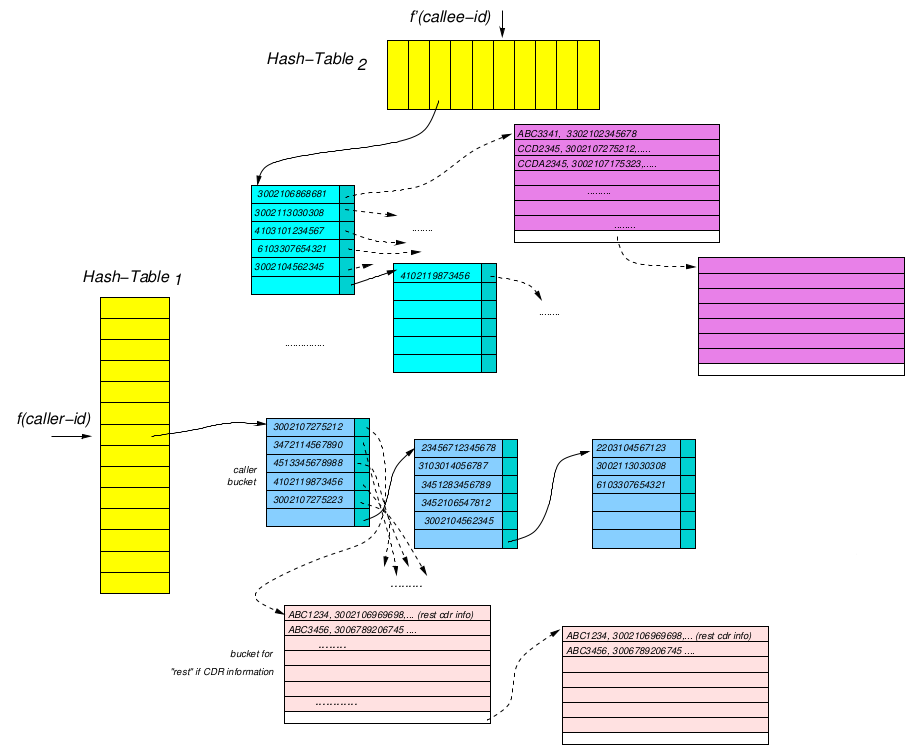
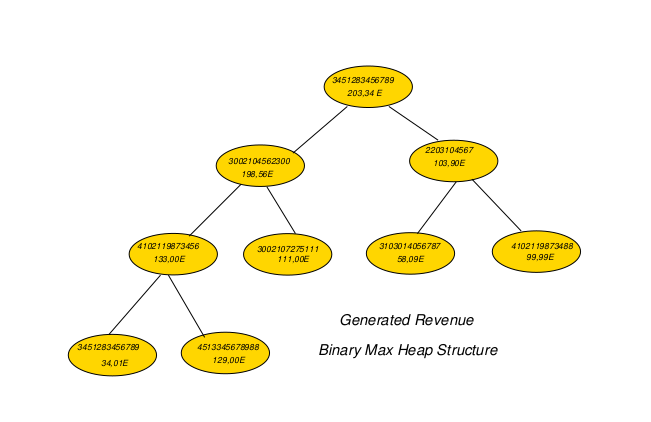

# Call Detail Record Management System

## About

The main objective of this project is to implement a variety of data structures that enable inserting, modifying, as well as some other types of queries on a large number of call detail records [[CDR]](https://en.wikipedia.org/wiki/Call_detail_record) . Despite the fact that input data are provided from text files, all records are stored only in main memory (not in disk) so that we can simulate a simple warehouse of CDRs alongside with some methods to access them.

## Implementation

### CDR format

Each CDR is an ASCII line consisting of the following parts:

1. **cdr-uniq-id** : unique identifier for each record containing only capital letters and numbers

2. **originator-number** : calling number consisting of a 3-digit country code and a 10-digit telephone number (e.g. 357-2127272314\)

3. **destination-number** : called number with the same format as the originator one

4. **date** : call's date with DDMMYYYY format

5. **init-time** : call's starting time with HH:MM format

6. **duration** : call's duration in minutes

7. **type** : call's type (e.g. voice call,SMS,e.t.c\)

8. **tarrif** : charging rate for this call

9. **fault-condition** : an integer number that describes if an error occurred during the call

### Data structures

  * Two hash-tables using bucket chains, one for the callers and one for the callees. The key given to the hash function is the caller number and the callee number respectively. Buckets are allocated dynamically, thus creating a linked list.

  * A binary max-heap which provides fast access to the "best" customers;namely, the ones who spend the most money for their calls.

  * Queue and linked list as auxiliary structures.

Images below illustrate the basic structures this application is implemented with :

### Operations

 * `insert <cdr-record>`

   inserts a CDR into the warehouse

   CDR format: `cdr-uniq-id;originator-number;destination-number;date;init-time;duration;type;tarrif;fault-condition`

 * `delete <caller> <cdr-id>`

   deletes the record with id as <cdr-id\> and caller number as <caller\>

 * `find <caller> [time1][date1] [time2][date2]`

   shows all the records of a caller (time/date interval is optional\)

   time format: HH:MM

   date format: DDMMYYYY

   Note that if [time1\] is provided, [time2\] must also be present. The same applies for the dates.

 * `lookup <callee> [time1][year1] [time2][year2]`

   shows all the calls the given callee has received (time/date interval is optional\)

 * `topdest <caller>`

   finds the top call destination for the given caller;that is, the number that the given caller has called most

 * `top <k>`

   finds the subscriber numbers that comprise the top-k% of the company's revenue

 * `bye`

   warehouse application terminates

   Memory allocated for the data structures is freed. Subsequently, new empty structures are created.

 * `print <hashttableX>`

   prints hash-table's X content [X:1 for callers' table , X:2 for callees'\]

## Usage

  1. `make`
  2. `./build/werhauz -o operations-file -h1 Hashtable1NumOfEntries -h2 Hashtable2NumOfEntries -s bucket_size -c config-file`

* operations-file: input file containing the operation to be applied on the structures (insert,delete,find e.t.c). Such operations can be inserted manually too via the prompt.

* Hashtable1NumOfEntries: number of entries for callers' hashtable

* Hashtable2NumOfEntries: number of entries for callees' hashtable

* bucket_size: bucket size in bytes

* config-file: optional file used for configuring the application. You can see an explanation [here](./input_files/explanation.txt)

 *Options can be given in any order.*

 *You may use the [run.sh](./run.sh) script if it suits you better.*

